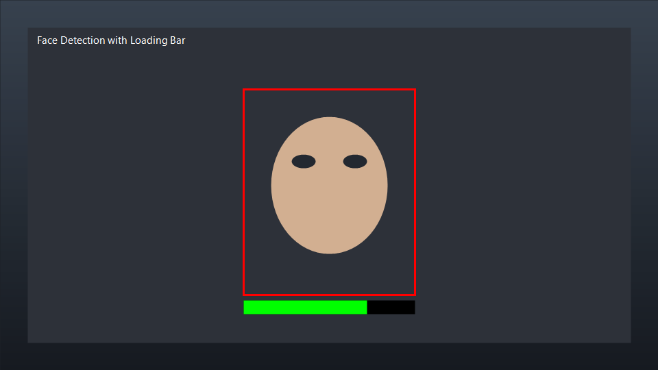

# Face Detection with Loading Bar

Webcam face detection using OpenCV. When a face is found, a loading bar fills underneath it and then shows "Scan Complete".

School project from FECAP (Brazil).

## Demo



## Setup

```bash
git clone https://github.com/matheusmaggiorini/Face-recognition-with-AI-.git
cd Face-recognition-with-AI-
python -m venv .venv
.venv\Scripts\activate
pip install -r requirements.txt
python face_detection.py
```

Press `q` to exit.

## Stack

- Python
- OpenCV

## Files

- `face_detection.py` — main script
- `requirements.txt` — dependencies
