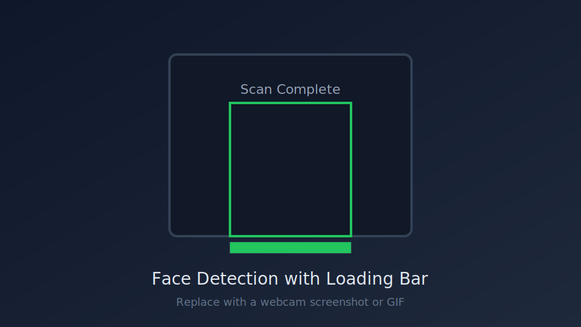

# Face Detection with Loading Bar

Real-time webcam face detection built with OpenCV and Haar cascades. Each detected face gets a progress bar that fills over a few seconds, then displays a **Scan Complete** status — useful as a computer vision demo or interactive kiosk prototype.

Developed during my **AI technical program at FECAP (Brazil)**.

## Demo



> Replace `assets/demo-preview.svg` with a screenshot or GIF from your webcam when you have one.

## Features

- Live face detection from a webcam feed
- Per-face loading bar with visual feedback
- Automatic reset cycle when all visible faces finish scanning
- Lightweight stack — no deep learning models required

## Tech Stack

- Python 3.10+
- OpenCV (`opencv-python`)
- Haar Cascade classifier (`haarcascade_frontalface_default`)

## Getting Started

### 1. Clone the repository

```bash
git clone https://github.com/matheusmaggiorini/Face-recognition-with-AI-.git
cd Face-recognition-with-AI-
```

### 2. Create a virtual environment (recommended)

```bash
python -m venv .venv

# Windows
.venv\Scripts\activate

# macOS / Linux
source .venv/bin/activate
```

### 3. Install dependencies

```bash
pip install -r requirements.txt
```

### 4. Run the application

```bash
python face_detection.py
```

Press **`q`** to quit.

## How It Works

1. Captures frames from the default webcam (`VideoCapture(0)`)
2. Converts each frame to grayscale for detection
3. Detects faces using a pre-trained Haar cascade
4. Draws a loading bar under each new face for 2 seconds
5. Marks completed faces and resets when every face on screen is done

## Project Structure

```
Face-recognition-with-AI-/
├── face_detection.py   # Main application
├── requirements.txt
├── assets/
│   └── demo-preview.svg
└── README.md
```

## Author

**Matheus Maggiorini**

- GitHub: [@matheusmaggiorini](https://github.com/matheusmaggiorini)
- Computer Programming and Analysis student @ Humber College
- AI background (FECAP) | Fortinet certified

## License

MIT — see [LICENSE](LICENSE).
